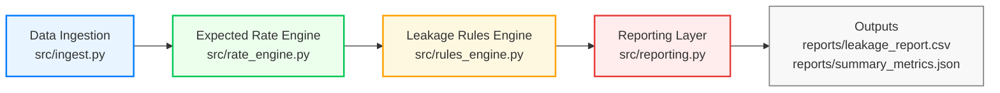

# 🚚 Invoice-MatchAI  

<p align="center">
  
  
  
  
  
</p>

---

### 🏷️ Version 1.0.0 — *AI-Infrastructure Refactor*
This release marks the first production-ready version of **Invoice-MatchAI**, featuring:
- Modular ingestion, pricing, and rules engine architecture  
- Real-time leakage detection and financial impact summaries  
- Audit-ready reporting in CSV and JSON formats  
- Clean CI/CD-friendly structure ready for cloud deployment  

To cite or reference this version, use:

**AI-Driven Revenue Integrity Pipeline for Freight & Logistics**

Invoice-MatchAI automates the reconciliation of freight invoices by comparing **actual billed charges** against **AI-derived expected rates**, identifying underbilling, dropped accessorials, and missed fuel surcharges.  
It transforms manual financial validation into a repeatable, audit-ready process built with modern data engineering principles.

---

## 🔍 Overview

Traditional invoice audits rely on manual reviews and static rate tables, which often miss subtle pricing discrepancies.  
**Invoice-MatchAI** introduces a modular, Python-based pipeline that computes expected billing, applies compliance rules, and quantifies potential revenue leakage in near-real-time.

### ✨ Core Capabilities
- **Automated Ingestion & Validation** — Reads and validates structured freight data with schema enforcement.  
- **Pricing Intelligence Engine** — Calculates expected linehaul, fuel surcharge, and accessorial totals from business logic.  
- **Leakage Detection Rules** — Flags underbilled shipments, missing surcharges, and liftgate service mismatches.  
- **Financial Reporting Layer** — Produces both audit-ready CSVs and summarized JSON reports for executive review.  
- **One-Command Workflow**
  ```bash
  python3 -m src.run_pipeline
  ```

---

## 🧠 System Architecture



> The pipeline converts complex logistics data into explainable financial insights, enabling CFOs and operations leaders to detect silent margin erosion before it compounds.

---

## 📊 Example Run

```
=== PIPELINE SUMMARY ===
Total shipments: 5
Flagged shipments: 3 (60.0%)
Est. leakage $: 159.08
Leakage report written to: reports/leakage_report.csv
Summary metrics written to: reports/summary_metrics.json
```

---

## 🧩 Module Breakdown

| Layer | File | Description |
|-------|------|--------------|
| **Ingest** | `src/ingest.py` | Loads CSV data and validates required schema fields. |
| **Pricing Engine** | `src/rate_engine.py` | Computes expected billed totals using rate logic. |
| **Rules Engine** | `src/rules_engine.py` | Applies underbilling and compliance detection rules. |
| **Reporting** | `src/reporting.py` | Summarizes flagged rows and aggregates leakage metrics. |
| **Pipeline Runner** | `src/run_pipeline.py` | Orchestrates the entire workflow from CLI. |

---

## 📁 Repository Structure

```
invoice-matchai/
├── data/                # Sample datasets
├── notebooks/           # Exploratory notebooks
├── src/                 # Source modules
│   ├── ingest.py
│   ├── rate_engine.py
│   ├── rules_engine.py
│   ├── reporting.py
│   └── run_pipeline.py
├── reports/             # Generated outputs (ignored in git)
├── README.md
├── requirements.txt
└── LICENSE
```

---

## 🧪 Installation

```bash
# Clone the repository
git clone https://github.com/Joshitha-Uppalapati/invoice-matchai.git
cd invoice-matchai

# Create a virtual environment
python3 -m venv venv
source venv/bin/activate  # Mac/Linux

# Install dependencies
pip install -r requirements.txt
```

---

## 🚀 Usage

To execute the full pipeline:

```bash
python3 -m src.run_pipeline
```

Generated outputs:
- **reports/leakage_report.csv** → detailed per-shipment discrepancies  
- **reports/summary_metrics.json** → aggregated leakage statistics  

---

## 🔮 Roadmap

- [ ] Add anomaly detection (IsolationForest on billing deviations)  
- [ ] Build Streamlit dashboard for KPI visualization  
- [ ] Integrate with AWS S3 / RDS for scalable deployment  
- [ ] Extend rule engine with configurable business thresholds  
- [ ] LLM-based narrative summaries for flagged shipments  

---

## 🧾 License
This project is released under the **MIT License**.  
See [`LICENSE`](./LICENSE) for details.

---

## 💡 Author
**Joshitha Uppalapati**  
[🔗 LinkedIn](https://linkedin.com/in/joshitha-uppalapati) • [💻 GitHub](https://github.com/Joshitha-Uppalapati)