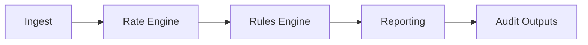

# Invoice-MatchAI
Built as a prototype logistics auditing engine that simulates how real freight billing leakage detection systems operate in production.

Invoice-MatchAI detects underbilling, missing fuel surcharges, and dropped accessorial fees by comparing expected vs actual freight charges. It turns messy invoice validation into a reproducible data pipeline.

---

## What this project demonstrates
This repo is not just a script. It models a simplified version of a real freight audit system:

- Structured ingestion of invoice data
- Deterministic pricing engine
- Rule-based leakage detection
- Financial impact summarization
- Audit-ready reporting
- Reproducible synthetic dataset generation
- One-command demo workflow

This mirrors the architecture used in logistics revenue integrity platforms.

## Real Results (1k Shipment Run)
- 4.7% shipments flagged
- $8.5k simulated recoverable leakage
- 100% precision
- 71% recall
- Automated anomaly detection + explanations

See: docs/findings.md

---
## Quick demo
Run the full pipeline:
```bash
./scripts/demo.sh
```

or

```bash
PYTHONPATH=. python3 -m src.run_pipeline
```

Outputs:
```
reports/leakage_report.csv
reports/summary_metrics.json
```

---

## Example output
```
shipment_id: 873328DB3B85
reason: UNDERBILLED
estimated leakage: $532.06
```

The full leakage report is exported as structured CSV for downstream systems.

---

## System architecture


Each stage is isolated and testable.

---

## Repository structure
```
invoice-matchai/
├── data/
│   ├── generators/        # Synthetic dataset generator
│   └── freight_invoices_1k.csv
├── scripts/
│   └── demo.sh            # One-command pipeline demo
├── src/
│   ├── ingest.py
│   ├── rate_engine.py
│   ├── rules_engine.py
│   ├── reporting.py
│   └── run_pipeline.py
├── reports/               # Generated outputs
└── notebooks/
```

---

## Reproducible dataset

Synthetic freight invoices are generated with a fixed seed.

```bash
python data/generators/synthetic_invoice_generator.py \
  --out data/freight_invoices_1k.csv \
  --seed 42 \
  --n 1000
```

This guarantees identical results across runs.

The dataset contains:
- realistic freight spend distribution
- injected billing errors
- measurable leakage ground truth

---

## Installation

```bash
git clone https://github.com/Joshitha-Uppalapati/invoice-matchai.git
cd invoice-matchai

python3 -m venv venv
source venv/bin/activate
pip install -r requirements.txt
```

---

## Use cases
This system models real scenarios such as:

- freight invoice auditing
- revenue leakage detection
- logistics compliance checks
- automated financial validation
- pre-payment invoice verification

---

## Roadmap
- anomaly detection on pricing drift
- dashboard for leakage analytics
- cloud storage integration
- configurable rule engine
- narrative summaries for audit reports

---

## Author
Joshitha Uppalapati  
https://github.com/Joshitha-Uppalapati  
https://linkedin.com/in/joshitha-uppalapati

---

## License
MIT